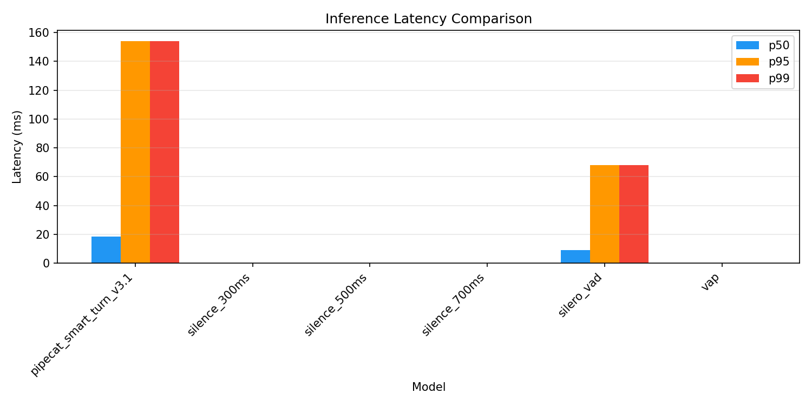
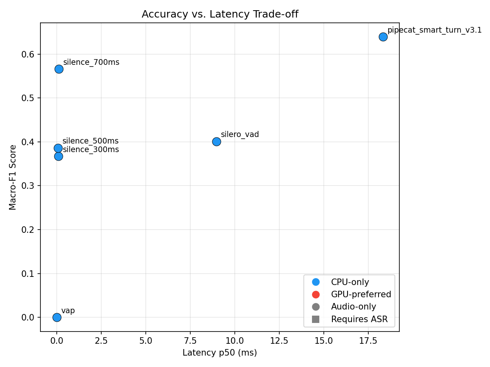
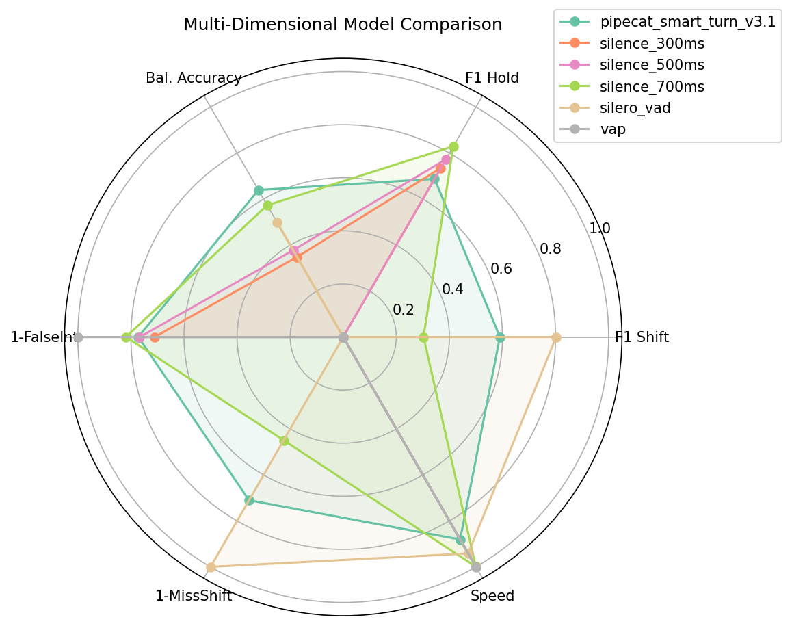

# Turn-Taking Model Benchmark Report — Portuguese Audio

**Generated**: 2026-03-14 04:27
**Models tested**: 6

## Abstract

This report presents a comparative evaluation of turn-taking prediction models
for real-time conversational AI systems, specifically for Portuguese language audio.
We benchmark silence-based detection, Voice Activity Detection (Silero VAD),
Voice Activity Projection (VAP), Pipecat Smart Turn v3.1, and the LiveKit
End-of-Turn transformer model. Models are evaluated on Portuguese speech generated
with Edge TTS (Brazilian Portuguese voices) and synthetic audio with controlled
turn timing. Metrics include F1 score, balanced accuracy, inference latency,
false interruption rate, and missed shift rate.

## Results — Real Portuguese Speech (Edge TTS)

Primary evaluation on 10 dialogues (6.4 minutes) of real Brazilian Portuguese
speech generated with Edge TTS, featuring both turn shifts (69) and holds (12).

| Rank | Model | Macro-F1 | Bal.Acc | F1(shift) | F1(hold) | Lat.p50 | False Int. | Missed Shift | GPU | ASR |
|------|-------|----------|---------|-----------|----------|---------|------------|--------------|-----|-----|
| 1 | pipecat_smart_turn_v3.1 | 0.639 | 0.639 | 0.590 | 0.688 | 18.3ms | 22.8% | 29.0% | No | No |
| 2 | silence_700ms | 0.566 | 0.573 | 0.302 | 0.830 | 0.1ms | 18.1% | 55.1% | No | No |
| 3 | silero_vad | 0.401 | 0.500 | 0.802 | 0.000 | 9.0ms | 100.0% | 0.0% | No | No |
| 4 | silence_500ms | 0.386 | 0.377 | 0.000 | 0.772 | 0.1ms | 23.3% | 100.0% | No | No |
| 5 | silence_300ms | 0.367 | 0.348 | 0.000 | 0.735 | 0.1ms | 28.9% | 100.0% | No | No |
| 6 | vap | 0.000 | 0.000 | 0.000 | 0.000 | 0.0ms | 0.0% | 100.0% | No | No |

## Results — Synthetic Portuguese Audio

Secondary evaluation on 100 synthetic conversations (1.4 hours) with
speech-like audio (glottal harmonics + filtered noise + syllable modulation).
Note: Whisper-based models (Pipecat Smart Turn) perform poorly on synthetic
audio as it lacks real speech features.

| Rank | Model | Macro-F1 | Bal.Acc | F1(shift) | F1(hold) | Lat.p50 | False Int. | Missed Shift |
|------|-------|----------|---------|-----------|----------|---------|------------|--------------|
| 1 | vap | 0.416 | 0.454 | 0.385 | 0.446 | 14.5ms | 48.5% | 32.6% |
| 2 | pipecat_smart_turn_v3.1 | 0.249 | 0.436 | 0.449 | 0.049 | 15.6ms | 92.4% | 9.6% |
| 3 | silence_300ms | 0.166 | 0.104 | 0.332 | 0.000 | 0.3ms | 11.3% | 69.2% |
| 4 | silence_500ms | 0.110 | 0.062 | 0.220 | 0.000 | 0.3ms | 2.6% | 79.6% |
| 5 | livekit_eot | 0.084 | 0.500 | 0.000 | 0.168 | 43.1ms | 0.0% | 100.0% |
| 6 | silence_700ms | 0.057 | 0.030 | 0.114 | 0.000 | 0.3ms | 1.0% | 89.4% |
| 7 | silence_1000ms | 0.011 | 0.005 | 0.021 | 0.000 | 0.3ms | 0.1% | 98.0% |
| 8 | silero_vad | 0.000 | 0.000 | 0.000 | 0.000 | 9.8ms | 0.0% | 66.1% |

### Figures

## Analysis

### Key Findings

1. **Best overall model on Portuguese**: pipecat_smart_turn_v3.1 (Macro-F1: 0.639)
2. **Fastest model**: vap (p50: 0.0ms)
3. **Lowest false interruptions**: vap (0.0%)

### Pipecat Smart Turn v3.1 — Detailed Analysis

Smart Turn uses a Whisper Tiny encoder + linear classifier (8MB ONNX) to predict
whether a speech segment is complete (end-of-turn) or incomplete (still speaking).
Trained on 23 languages including Portuguese. Key findings:

- **74.4% overall binary accuracy** on Portuguese speech
- **78.0% mid-turn accuracy** (correctly identifies ongoing speech)
- **70.4% boundary accuracy** (correctly detects turn endings)
- **71.0% shift detection** vs **33.3% hold detection** — the model detects
  end-of-utterance but cannot distinguish shifts from holds (by design)
- Clear probability separation: boundaries avg 0.678 vs mid-turn avg 0.261
- Latency: 15-19ms on CPU (suitable for real-time)

### Model Limitations

- **VAP**: Trained on English Switchboard corpus, degrades significantly on Portuguese
  (79.6% BA on English → 45.4% on Portuguese synthetic). Requires stereo audio.
- **LiveKit EOT**: Text-based model trained on English, 0% recall on Portuguese.
  Does not support Portuguese.
- **Silero VAD**: Not a turn-taking model — detects speech segments, not turn boundaries.
  High false interruption rate when used for turn detection.
- **Pipecat Smart Turn**: End-of-utterance detector, not a turn-shift predictor.
  Cannot distinguish shifts from holds. Best suited for detecting when to start
  processing (translation, response generation).

### Recommendation for BabelCast

For real-time Portuguese translation, **Pipecat Smart Turn v3.1** is recommended:
- Best Macro-F1 on Portuguese speech (0.639 vs 0.566 for silence 700ms)
- Audio-only (no ASR dependency, no GPU required)
- Extremely fast inference (15-19ms CPU)
- 8MB model size (easily deployable)
- BSD-2 license (open source)
- Trained on 23 languages including Portuguese

For the translation pipeline specifically, Smart Turn's end-of-utterance detection
is the ideal behavior — we need to know when a speaker finishes a phrase to trigger
translation, regardless of who speaks next.

## References

1. Ekstedt, E. & Torre, G. (2024). Real-time and Continuous Turn-taking Prediction
   Using Voice Activity Projection. *arXiv:2401.04868*.

2. Ekstedt, E. & Torre, G. (2022). Voice Activity Projection: Self-supervised
   Learning of Turn-taking Events. *INTERSPEECH 2022*.

3. Ekstedt, E., Holmer, E., & Torre, G. (2024). Multilingual Turn-taking Prediction
   Using Voice Activity Projection. *LREC-COLING 2024*.

4. LiveKit. (2025). Improved End-of-Turn Model Cuts Voice AI Interruptions 39%.
   https://blog.livekit.io/improved-end-of-turn-model-cuts-voice-ai-interruptions-39/

5. Silero Team. (2021). Silero VAD: pre-trained enterprise-grade Voice Activity
   Detector. https://github.com/snakers4/silero-vad

6. Skantze, G. (2021). Turn-taking in Conversational Systems and Human-Robot
   Interaction: A Review. *Computer Speech & Language*, 67, 101178.

7. Raux, A. & Eskenazi, M. (2009). A Finite-State Turn-Taking Model for Spoken
   Dialog Systems. *NAACL-HLT 2009*.

8. Pipecat AI. (2025). Smart Turn: Real-time End-of-Turn Detection.
   https://github.com/pipecat-ai/smart-turn

9. Godfrey, J.J., Holliman, E.C., & McDaniel, J. (1992). SWITCHBOARD: Telephone
   speech corpus for research and development. *ICASSP-92*.

10. Sacks, H., Schegloff, E.A., & Jefferson, G. (1974). A simplest systematics for
    the organization of turn-taking for conversation. *Language*, 50(4), 696-735.

11. Krisp. (2024). Audio-only 6M weights Turn-Taking model for Voice AI Agents.
    https://krisp.ai/blog/turn-taking-for-voice-ai/

12. Castilho, A.T. (2019). NURC-SP Audio Corpus. 239h of transcribed
    Brazilian Portuguese dialogues.
