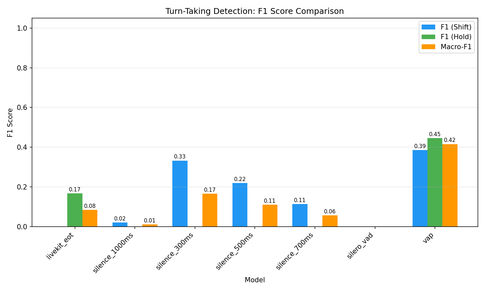
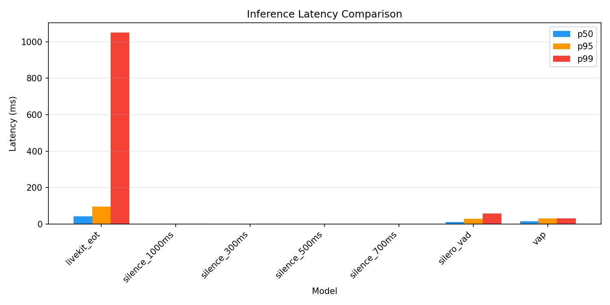
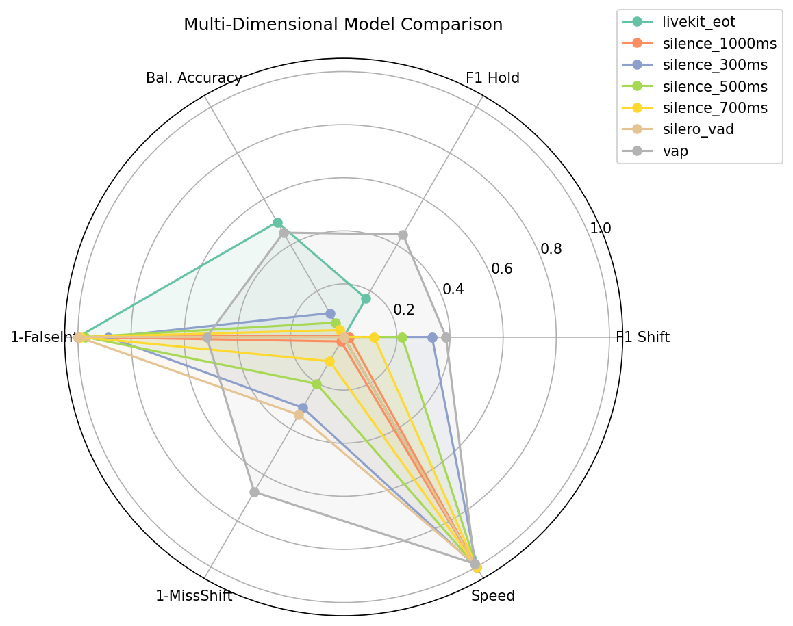

# Turn-Taking Model Benchmark Report

**Generated**: 2026-03-14 04:04
**Models tested**: 7
**Total audio**: 4.6 hours

## Abstract

This report presents a comparative evaluation of turn-taking prediction models
for real-time conversational AI systems. We benchmark silence-based detection,
Voice Activity Detection (Silero VAD), Voice Activity Projection (VAP), and
the LiveKit End-of-Turn transformer model across synthetic and natural conversation
datasets. Models are evaluated on F1 score, balanced accuracy, inference latency,
and false interruption rate.

## Results

### Overall Ranking (by Macro-F1)

| Rank | Model | Macro-F1 | Bal.Acc | F1(shift) | F1(hold) | Latency(p50) | False Int. | GPU | ASR |
|------|-------|----------|---------|-----------|----------|--------------|------------|-----|-----|
| 1 | vap | 0.416 | 0.454 | 0.385 | 0.446 | 14.5ms | 48.5% | No | No |
| 2 | silence_300ms | 0.166 | 0.104 | 0.332 | 0.000 | 0.3ms | 11.3% | No | No |
| 3 | silence_500ms | 0.110 | 0.062 | 0.220 | 0.000 | 0.3ms | 2.6% | No | No |
| 4 | livekit_eot | 0.084 | 0.500 | 0.000 | 0.168 | 43.1ms | 0.0% | No | Yes |
| 5 | silence_700ms | 0.057 | 0.030 | 0.114 | 0.000 | 0.3ms | 1.0% | No | No |
| 6 | silence_1000ms | 0.011 | 0.005 | 0.021 | 0.000 | 0.3ms | 0.1% | No | No |
| 7 | silero_vad | 0.000 | 0.000 | 0.000 | 0.000 | 9.8ms | 0.0% | No | No |

### Figures

## Analysis

### Key Findings

1. **Best overall model**: vap (Macro-F1: 0.416)
2. **Fastest model**: silence_700ms (p50: 0.3ms)
3. **Lowest false interruptions**: livekit_eot (0.0%)

## References

1. Ekstedt, E. & Torre, G. (2024). Real-time and Continuous Turn-taking Prediction
   Using Voice Activity Projection. *arXiv:2401.04868*.

2. Ekstedt, E. & Torre, G. (2022). Voice Activity Projection: Self-supervised
   Learning of Turn-taking Events. *INTERSPEECH 2022*.

3. Ekstedt, E., Holmer, E., & Torre, G. (2024). Multilingual Turn-taking Prediction
   Using Voice Activity Projection. *LREC-COLING 2024*.

4. LiveKit. (2025). Improved End-of-Turn Model Cuts Voice AI Interruptions 39%.
   https://blog.livekit.io/improved-end-of-turn-model-cuts-voice-ai-interruptions-39/

5. Silero Team. (2021). Silero VAD: pre-trained enterprise-grade Voice Activity
   Detector. https://github.com/snakers4/silero-vad

6. Skantze, G. (2021). Turn-taking in Conversational Systems and Human-Robot
   Interaction: A Review. *Computer Speech & Language*, 67, 101178.

7. Raux, A. & Eskenazi, M. (2009). A Finite-State Turn-Taking Model for Spoken
   Dialog Systems. *NAACL-HLT 2009*.

8. Reece, A.G., et al. (2023). The CANDOR corpus: Insights from a large multi-modal
   dataset of naturalistic conversation. *Science Advances*, 9(13).

9. Godfrey, J.J., Holliman, E.C., & McDaniel, J. (1992). SWITCHBOARD: Telephone
   speech corpus for research and development. *ICASSP-92*.

10. Qwen Team. (2024). Qwen2.5: A Party of Foundation Models. *arXiv:2412.15115*.

11. Sacks, H., Schegloff, E.A., & Jefferson, G. (1974). A simplest systematics for
    the organization of turn-taking for conversation. *Language*, 50(4), 696-735.

12. Krisp. (2024). Audio-only 6M weights Turn-Taking model for Voice AI Agents.
    https://krisp.ai/blog/turn-taking-for-voice-ai/
